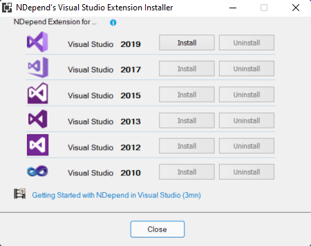
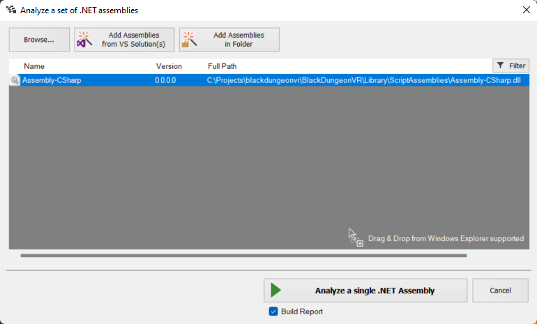

Patrick, the creator of the code analysis tool NDepend, recently contacted me and asked if I could provide some feedback about the latest release, v2021.1. I was pleasantly surprised to find support for both Unity and mobile applications development, as explained in detail in the release notes.

The new Unity application support is particularly noteworthy: it enables complete assessment of the C# scrips associated with a project to identify improvements that can be applied to the code. It is worth mentioning that performance is always a top priority in Unity applications; hence the availability of automated tools for highlighting enhancements is a fundamental part of the project lifecycle.

For this reason, NDepend default settings have been updated not to highlight false positives: as an example, the Fields should be declared as private rule is now disabled for these projects as it is often better, for performance reasons, to use fields instead of properties (some excellent presentations about performance from the Unite Now 2020 conference are available here and here).

To start, I downloaded the trial version from the official site, and installed the product in my machine:
<figure></figure>

Additionally, a Visual Studio extension is available and can be installed for IDE integration:
<figure></figure>

I am often using Jetbrains Rider as an editor for Unity applications; in this case I found convenient to rely on the standalone executable <em>VisualNDepend</em> for performing all the code analysis.

To evaluate the new features available in the new release, I opened an old project I often use as a playground, which I know needs improvements from both a code and functionalities point of view. Using VisualNDepend, I selected the Visual Studio solution generated by Unity and chose the corresponding assembly Assembly-CSharp containing the custom scripts:
<figure></figure>

After the report-generation phase completed, it was possible to access the related dashboard which enabled the visualisation of the results. By selecting the desired namespace, it was possible to highlight specifics:
<figure></figure>

And from here, showing more details about the relations between the different classes using a dependency graph, which I personally find very informative to understand more about the project structure. From this visualisation, it was possible to better analyse the technical debt associated with the different parts:
<figure></figure>

I found particularly useful the usage of the integrated CLinq feature which enabled different queries to be performed on the code issues using LINQ:
<figure></figure>

At this stage, it was possible to quickly identify potential improvements in the various C# classes of the scripts, which can easily be refined using the integrated query tools.

The integrated Unity support available in NDepend is a valuable tool to guarantee good code quality in projects: I will definitely integrate it into my development workflow.

Happy coding!

