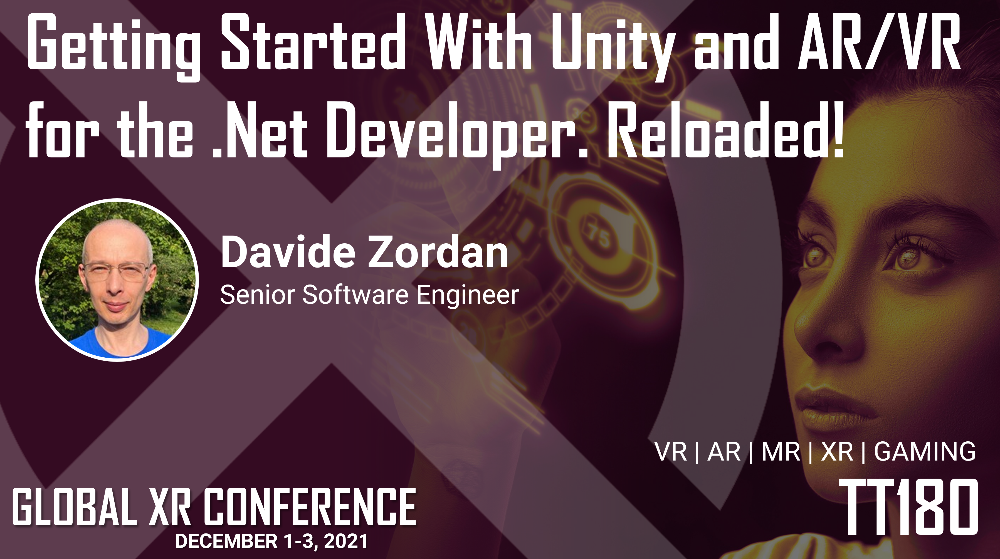

I have just uploaded the slides related to my session <em>Getting started with Unity and AR/VR for the .NET developer... Reloaded!</em> at <a href="https://globalxrconference.com/" target="_blank" rel="noopener">Global XR Conference 2021</a>.

<figure></figure>

<iframe src="//www.slideshare.net/slideshow/embed_code/key/JQkvam5dqVepO" width="595" height="485" frameborder="0" marginwidth="0" marginheight="0" scrolling="no" style="border:1px solid #CCC; border-width:1px; margin-bottom:5px; max-width: 100%;" allowfullscreen>
</iframe>

