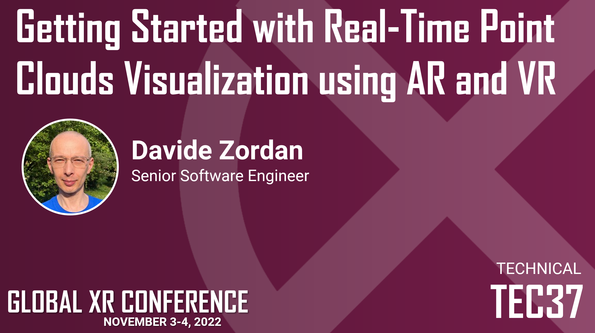

I have just uploaded the slides related to my session <em>Getting Started with Point Clouds and AR/VR</em> at <a href="https://globalxrconference.com/" target="_blank" rel="noopener">Global XR Conference 2022</a>.

<figure></figure>

<iframe src="//www.slideshare.net/slideshow/embed_code/key/CPBjWToGHaZbTR" width="595" height="485" frameborder="0" marginwidth="0" marginheight="0" scrolling="no" style="border:1px solid #CCC; border-width:1px; margin-bottom:5px; max-width: 100%;" allowfullscreen> </iframe>

The full video of the presentation is available on <a href="https://www.youtube.com/watch?v=fLJ_pID_-cA" target="_blank" rel="noopener">YouTube</a>.

The source code is available on <a href="https://github.com/davidezordan/remote-telepresence-vr" target="_blank" rel="noopener">GitHub</a>.
